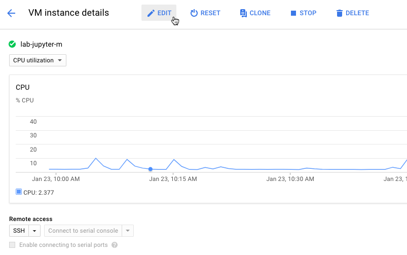

# Running Spark with Scala language on Jupyter

<div style="text-align: right"> 2018/01/22 </div>
<div style="text-align: right"> Lish Chen </div>

## 0x01 Preface

We want to run Spark with Scala language on Jupyter instead of Python to PySpark.

## 0x02 Install [Jupyter](http://jupyter.org/) on GCE
- In the GCP project, we choose the **Dataproc => Clusters** to create the Apache Hadoop clusters.


- Click **CREATE CLUSTER**


- Here is our configuration with 1 master, 2 workers.  
  
P.S. You can click **Customize** to choose your machine CPU cores and Memory.

- Next, Click the **Preemptible workers, bucket, network, version, initialization, & access options Create**


- In initialization actions add on bash shell that has been uploaded to Cloud Storage at gs://dataproc-initialization-actions/jupyter/jupyter.sh  


- After click **Create** the cluster, we can see them successfully running on the dashboard.


Now, we are going to configuration Jupyter and install Apache Toree.

## 0x03 Install [Apachea Toree](https://toree.incubator.apache.org/)
- Before installing the Apache Toree, we check our Scala and Spark version first. In the GCP project, we choose the **Compute Engine => VM instances** to use **ssh shell** into our master machine.


- Click the master machine ssh


### Scala version

```sh
lish@lab-jupyter-m:~$ scala
Welcome to Scala 2.11.8 (OpenJDK 64-Bit Server VM, Java 1.8.0_131).
Type in expressions for evaluation. Or try :help.

scala> :q
lish@lab-jupyter-m:~$
```

### Spark version

```
lish@lab-jupyter-m:~$ spark-submit --version
Welcome to
      ____              __
     / __/__  ___ _____/ /__
    _\ \/ _ \/ _ `/ __/  '_/
   /___/ .__/\_,_/_/ /_/\_\   version 2.2.0
      /_/
                        
Using Scala version 2.11.8, OpenJDK 64-Bit Server VM, 1.8.0_131
Branch dataproc-branch-1.2
Compiled by user  on 2017-11-02T20:44:34Z
Revision 8487a9392de29699542e19cc3babc2f323e71119
Url https://bigdataoss-internal.googlesource.com/third_party/apache/bigtop
Type --help for more information.
lish@lab-jupyter-m:~$ 
```

- Now, we check the Scala and Spark version of Apache toree. In our case, we use the lastest releases **v0.2.0-incubating-rc3** https://github.com/apache/incubator-toree/releases. We can find these information in [Makefile](https://github.com/apache/incubator-toree/blob/v0.2.0-incubating-rc3/Makefile). If the version numbers are inconsistent, you can modify the Makefile and use **make release** to rebuild.

```sh
...
30 APACHE_SPARK_VERSION?=2.2.0
31 SCALA_VERSION?=2.11
...
```

- Let's get start to install Apache Toree!
```sh
lish@lab-jupyter-m:~$ sudo su -
root@lab-jupyter-m:~# pip install https://dist.apache.org/repos/dist/dev/incubator/toree/0.2.0-incubating-rc3/toree-pip/toree-0.2.0.tar.gzCollecting https://dist.apache.org/repos/dist/dev/incubator/toree/0.2.0-incubating-rc3/toree-pip/toree-0.2.0.tar.gz
  Downloading https://dist.apache.org/repos/dist/dev/incubator/toree/0.2.0-incubating-rc3/toree-pip/toree-0.2.0.tar.gz (25.8MB)
    100% |████████████████████████████████| 25.8MB 51kB/s 
Requirement already satisfied (use --upgrade to upgrade): jupyter_core>=4.0 in /opt/conda/lib/python3.5/site-packages (from toree==0.2.0)
Requirement already satisfied (use --upgrade to upgrade): jupyter_client>=4.0 in /opt/conda/lib/python3.5/site-packages (from toree==0.2.0)
Requirement already satisfied (use --upgrade to upgrade): traitlets<5.0,>=4.0 in /opt/conda/lib/python3.5/site-packages (from toree==0.2.0)
Building wheels for collected packages: toree
  Running setup.py bdist_wheel for toree ... done
  Stored in directory: /root/.cache/pip/wheels/2c/a1/6f/9fc349f7045b8445781969e3e1c546e0d4bdc2a8461dcab744
Successfully built toree
Installing collected packages: toree
Successfully installed toree-0.2.0
You are using pip version 8.1.2, however version 9.0.1 is available.
You should consider upgrading via the 'pip install --upgrade pip' command.
root@lab-jupyter-m:~# find / -iname spark -type d
/usr/share/doc/spark
/usr/lib/spark
/usr/lib/spark/examples/src/main/scala/org/apache/spark
/usr/lib/spark/examples/src/main/java/org/apache/spark
/etc/spark
/run/spark
/var/log/spark
/var/lib/spark
/hadoop/spark
root@lab-jupyter-m:~# jupyter toree install --spark_home=/usr/lib/spark
[ToreeInstall] Installing Apache Toree version 0.2.0
[ToreeInstall] 
Apache Toree is an effort undergoing incubation at the Apache Software
Foundation (ASF), sponsored by the Apache Incubator PMC.

Incubation is required of all newly accepted projects until a further review
indicates that the infrastructure, communications, and decision making process
have stabilized in a manner consistent with other successful ASF projects.

While incubation status is not necessarily a reflection of the completeness
or stability of the code, it does indicate that the project has yet to be
fully endorsed by the ASF.
[ToreeInstall] Creating kernel Scala
[ToreeInstall] Installed kernelspec apache_toree_scala in /usr/local/share/jupyter/kernels/apache_toree_scala
root@lab-jupyter-m:~# 
```

- We successfully install the Apache Toree on Jupyter! Before starting Jupyter, for some reason ... our Internet can only connect 80/443 port ... Go to **VM instances** and choose the master machine.  
  

- EDIT  


- Firewalls enable the **Allow HTTP traffic** and Save  


## 0x04 Jupyter
- starting the Jupyter
```sh 
root@lab-jupyter-m:~# jupyter notebook --port 80 --allow-root --ip 0.0.0.0
```

- We can connect with the **External IP**


- Now, we can new a Apache Toree - Scala notebook in Jupyter!


- Testing!


